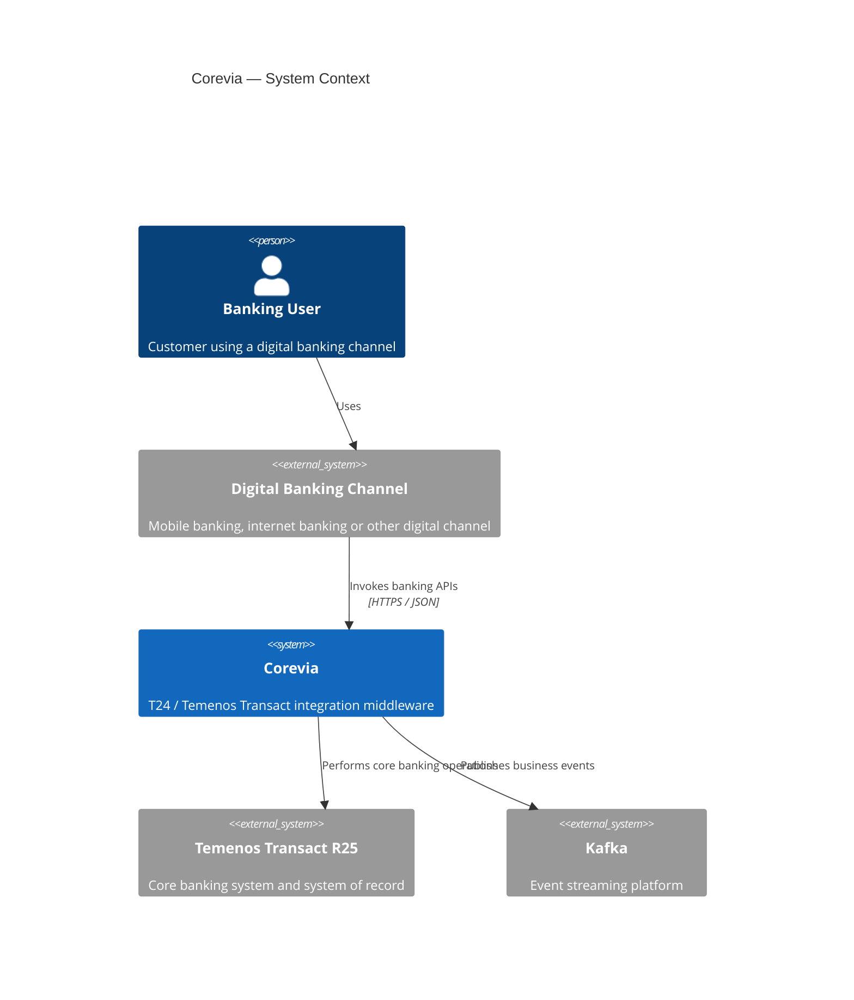
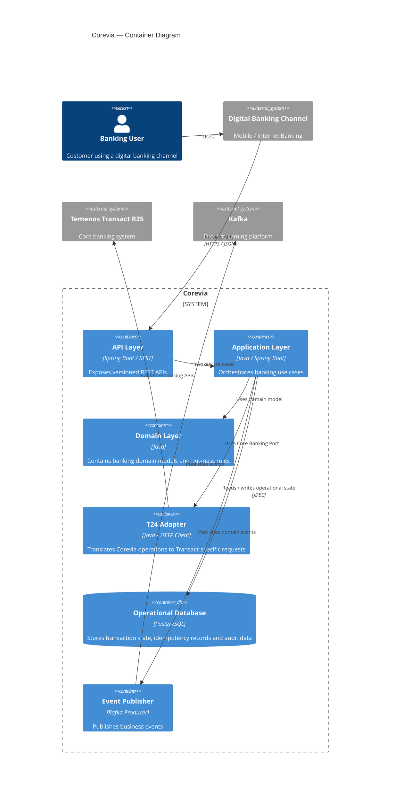
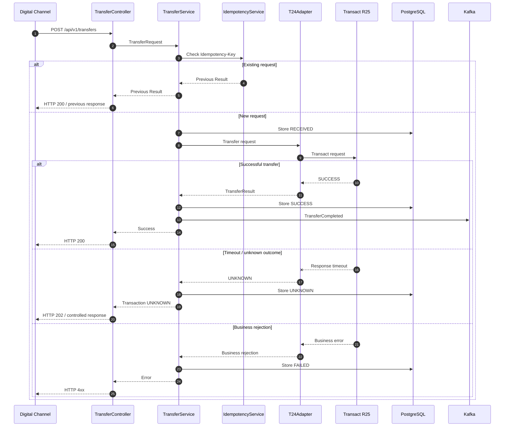
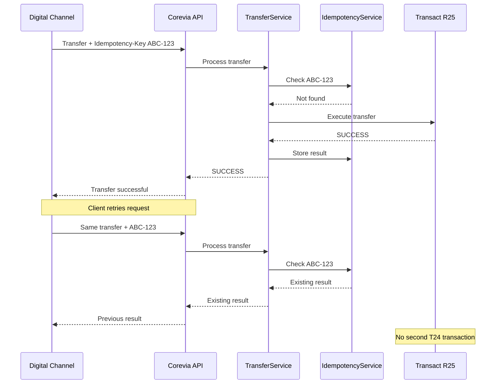
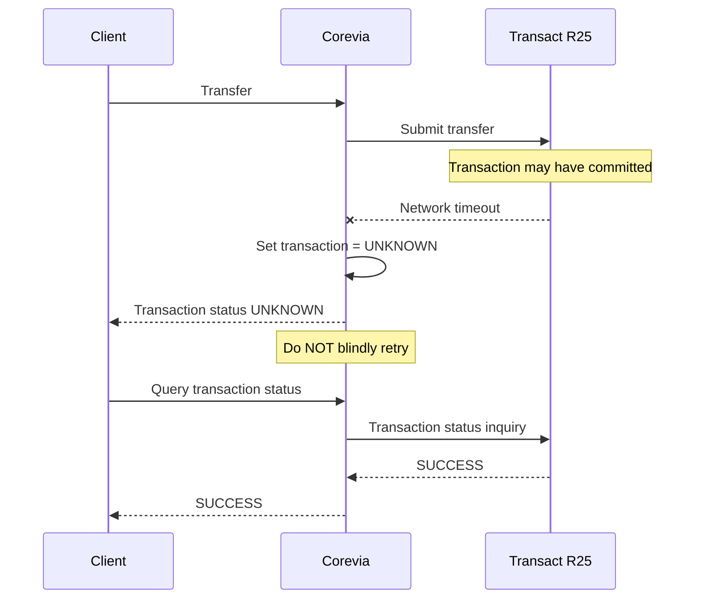
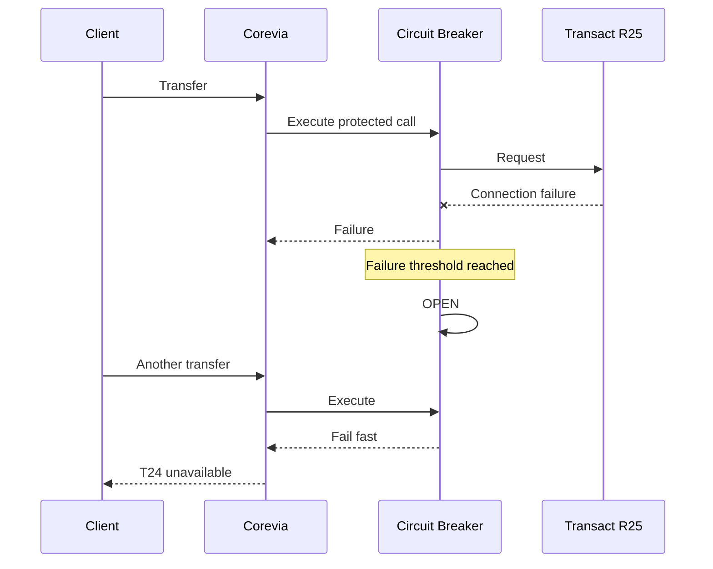
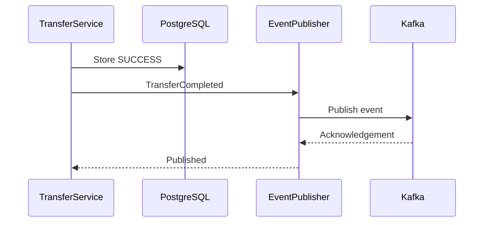
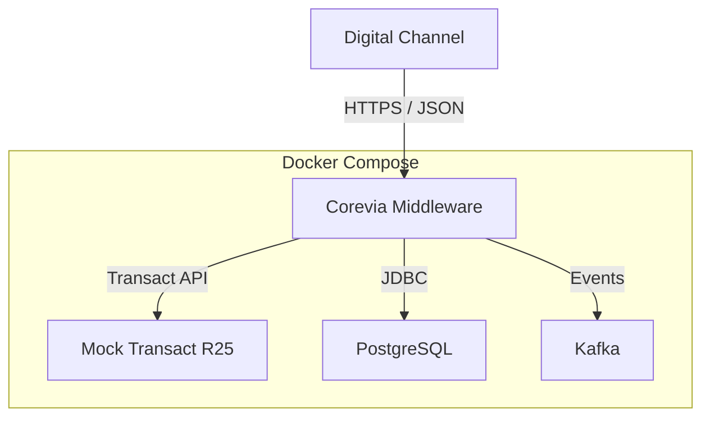
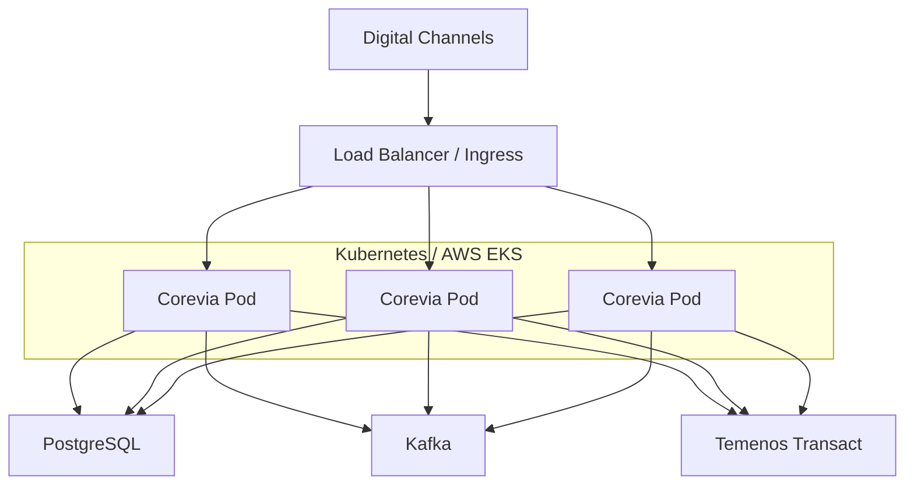

# Corevia — C4 Architecture

**Project:** Corevia
**System:** T24 / Temenos Transact Integration Middleware
**Target Core:** Temenos Transact R25
**Architecture:** C4 Model
**Diagram Format:** Mermaid

---

# 1. C4 Model Overview

Corevia is documented using four C4 levels:

```text
Level 1 — System Context
        ↓
Level 2 — Container
        ↓
Level 3 — Component
        ↓
Level 4 — Code
```

For this project, Levels 1–3 are the primary architecture views.

Level 4 is intentionally kept lightweight because implementation details should remain in the source code.

---

# 2. Level 1 — System Context

## 2.1 Context Diagram

The System Context diagram shows Corevia and the external systems that interact with it.



---

## 2.2 Context Description

### Banking User

Represents the end user of the banking system.

The user does not interact directly with Corevia.

---

### Digital Banking Channel

Examples include:

* Mobile banking
* Internet banking
* Branch applications
* Internal enterprise applications

The channel communicates with Corevia through REST APIs.

---

### Corevia

The system being designed.

Corevia provides:

* Customer inquiry
* Account inquiry
* Funds transfer
* Transaction status
* Idempotency
* Resilience
* Audit
* Event publication

---

### Temenos Transact R25

The core-banking system.

For the showcase implementation, this is represented by a Mock Transact service.

Transact remains the conceptual system of record for:

* Accounts
* Balances
* Core transactions
* Transaction status

---

### Kafka

Kafka provides asynchronous event distribution.

Example:

```text
TransferCompleted
```

Potential future consumers include:

* Notification service
* Audit service
* Fraud monitoring
* Reconciliation
* Analytics

---

# 3. Level 2 — Container Diagram

## 3.1 Container Diagram



---

# 4. Container Responsibilities

## 4.1 API Layer

Technology:

```text
Spring Boot
Spring MVC
OpenAPI
```

Responsibilities:

* HTTP request handling
* API versioning
* Request validation
* Authentication
* Correlation ID
* HTTP response mapping

Example endpoints:

```text
GET  /api/v1/customers/{customerId}

GET  /api/v1/accounts/{accountId}

POST /api/v1/transfers

GET  /api/v1/transfers/{transactionId}
```

The API layer must not contain core banking integration logic.

---

# 4.2 Application Layer

Technology:

```text
Java 25
Spring Boot
```

Responsibilities:

* Use-case orchestration
* Transaction workflow
* Idempotency coordination
* Calling domain logic
* Calling ports
* Managing transaction state

Example services:

```text
TransferService
AccountInquiryService
CustomerInquiryService
TransactionStatusService
```

---

# 4.3 Domain Layer

The domain layer represents banking concepts independently of infrastructure.

Examples:

```text
Customer
Account
Money
Transfer
Transaction
TransactionStatus
```

The domain layer must not depend on:

```text
Spring MVC
Kafka
PostgreSQL
HTTP
T24
```

---

# 4.4 T24 Adapter

The T24 Adapter isolates Transact-specific integration.

Responsibilities:

* Build Transact requests
* Map Corevia models to Transact models
* Invoke Transact APIs
* Parse Transact responses
* Map Transact errors
* Handle technical communication errors

Conceptual structure:

```text
CoreBankingGateway
        |
        v
   T24Adapter
        |
        +-- RequestMapper
        |
        +-- T24Client
        |
        +-- ResponseMapper
        |
        +-- ErrorMapper
```

---

# 4.5 Operational Database

Technology:

```text
PostgreSQL
```

The database stores middleware-owned operational data.

Example entities:

```text
Transfer
IdempotencyRecord
AuditRecord
```

The database does **not** replace the Transact ledger.

---

# 4.6 Event Publisher

The Event Publisher converts application/domain events into Kafka messages.

Example:

```text
TransferCompleted
```

The publisher should be designed so the application does not depend directly on Kafka APIs.

---

# 5. Level 3 — Component Diagram

The Level 3 view focuses on the Corevia Middleware application.

```mermaid
C4Component

title Corevia — Middleware Component Diagram

Container_Boundary(corevia, "Corevia Middleware") {

    Component(transferController, "TransferController", "Spring MVC", "Receives transfer API requests")

    Component(accountController, "AccountController", "Spring MVC", "Receives account inquiry requests")

    Component(customerController, "CustomerController", "Spring MVC", "Receives customer inquiry requests")

    Component(transferService, "TransferService", "Application Service", "Orchestrates transfer workflow")

    Component(accountService, "AccountInquiryService", "Application Service", "Orchestrates account inquiry")

    Component(customerService, "CustomerInquiryService", "Application Service", "Orchestrates customer inquiry")

    Component(idempotencyService, "IdempotencyService", "Application Service", "Detects and prevents duplicate requests")

    Component(transactionService, "TransactionStateService", "Domain/Application Service", "Manages transaction lifecycle")

    Component(coreBankingGateway, "CoreBankingGateway", "Port", "Abstraction for core banking operations")

    Component(t24Adapter, "T24Adapter", "Adapter", "Implements CoreBankingGateway for Transact")

    Component(t24Client, "T24Client", "HTTP Client", "Communicates with Transact")

    Component(requestMapper, "T24RequestMapper", "Mapper", "Maps Corevia requests to Transact requests")

    Component(responseMapper, "T24ResponseMapper", "Mapper", "Maps Transact responses to Corevia models")

    Component(errorMapper, "T24ErrorMapper", "Mapper", "Maps Transact errors to domain errors")

    Component(transferRepository, "TransferRepository", "Port", "Persists transfer state")

    Component(idempotencyRepository, "IdempotencyRepository", "Port", "Persists idempotency state")

    Component(auditRepository, "AuditRepository", "Port", "Persists audit records")

    Component(eventPublisher, "EventPublisher", "Port", "Publishes domain events")
}

ContainerDb(database, "PostgreSQL", "Operational database")

System_Ext(transact, "Temenos Transact R25", "Core banking system")

System_Ext(kafka, "Kafka", "Event streaming platform")

Rel(transferController, transferService, "Invokes")

Rel(accountController, accountService, "Invokes")

Rel(customerController, customerService, "Invokes")

Rel(transferService, idempotencyService, "Checks idempotency")

Rel(transferService, transactionService, "Manages transaction state")

Rel(transferService, coreBankingGateway, "Executes transfer")

Rel(accountService, coreBankingGateway, "Retrieves account")

Rel(customerService, coreBankingGateway, "Retrieves customer")

Rel(coreBankingGateway, t24Adapter, "Implemented by")

Rel(t24Adapter, requestMapper, "Uses")

Rel(t24Adapter, t24Client, "Uses")

Rel(t24Adapter, responseMapper, "Uses")

Rel(t24Adapter, errorMapper, "Uses")

Rel(t24Client, transact, "Calls")

Rel(transferService, transferRepository, "Persists")

Rel(idempotencyService, idempotencyRepository, "Persists")

Rel(transferService, auditRepository, "Audits")

Rel(transferService, eventPublisher, "Publishes event")

Rel(transferRepository, database, "Reads / writes")

Rel(idempotencyRepository, database, "Reads / writes")

Rel(auditRepository, database, "Reads / writes")

Rel(eventPublisher, kafka, "Publishes")
```



---

# 6. Transfer Component Flow

The most important Corevia use case is funds transfer.



---

# 7. Duplicate Transfer Flow



---

# 8. T24 Timeout Flow



---

# 9. T24 Outage Flow



---

# 10. Event Flow

After a successful transfer:



---

# 11. Recommended Future Event Architecture

A later iteration may introduce a **Transactional Outbox**.

```text
Current:

TransferService
      |
      +----> PostgreSQL
      |
      +----> Kafka


Future:

TransferService
      |
      v
PostgreSQL
   |
   +---- Transfer
   |
   +---- Outbox Event
             |
             v
        Outbox Publisher
             |
             v
           Kafka
```

This reduces the risk of database/event publication inconsistency.

---

# 12. Deployment Diagram

## 12.1 Docker Compose



---

# 13. Future Kubernetes Deployment



---

# 14. Code-Level Structure

The proposed Java package structure is:

```text
com.corevia
│
├── api
│   ├── controller
│   ├── request
│   ├── response
│   └── exception
│
├── application
│   ├── service
│   └── port
│       ├── in
│       └── out
│
├── domain
│   ├── customer
│   ├── account
│   ├── transfer
│   └── transaction
│
├── infrastructure
│   ├── t24
│   │   ├── client
│   │   ├── mapper
│   │   ├── model
│   │   └── adapter
│   │
│   ├── persistence
│   │   ├── postgres
│   │   └── entity
│   │
│   ├── kafka
│   │   ├── producer
│   │   └── event
│   │
│   └── security
│
└── configuration
```

The exact package structure may evolve during implementation.

---

# 15. Architecture Principles

Corevia follows these principles:

## Principle 1 — T24 Is Isolated

T24-specific logic belongs inside the T24 adapter.

```text
Domain
  X
  |
  X--> T24 classes

Domain
  |
  v
Port
  |
  v
T24 Adapter
```

---

## Principle 2 — Core Banking Remains Authoritative

Corevia is middleware.

It is not a replacement core banking system.

---

## Principle 3 — Financial Operations Are Idempotent

A retry must not automatically create another financial transaction.

---

## Principle 4 — Timeout Does Not Mean Failure

When the outcome is uncertain:

```text
UNKNOWN
```

must be a valid state.

---

## Principle 5 — Synchronous for Decisions, Asynchronous for Events

Core banking transaction decisions remain synchronous where required.

Downstream notifications and secondary processing use events.

---

## Principle 6 — Infrastructure Is Replaceable

The application should not be tightly coupled to:

* PostgreSQL
* Kafka
* HTTP
* T24
* Spring

Ports and adapters provide the boundary.

---

# 16. C4 Architecture Summary

```text
LEVEL 1
System Context
     |
     v
Digital Channels
     |
     v
Corevia
     |
     +----> Temenos Transact R25
     |
     +----> Kafka


LEVEL 2
Containers
     |
     +---- API
     +---- Application
     +---- Domain
     +---- T24 Adapter
     +---- PostgreSQL
     +---- Kafka Publisher


LEVEL 3
Components
     |
     +---- Controllers
     +---- Application Services
     +---- Ports
     +---- T24 Adapter
     +---- Mappers
     +---- Repositories
     +---- Event Publisher


LEVEL 4
Code
     |
     +---- Java classes
     +---- interfaces
     +---- implementations
```

The architecture is intentionally designed to demonstrate **enterprise banking integration rather than CRUD application development**.
